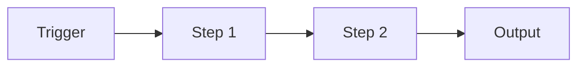

# Workflow – {{title}}

## Purpose
> What does this workflow accomplish end-to-end?

## Trigger
> How does this start? (cron, webhook, slash command, manual, file change)

## Steps

### Step 1: [Name]
- **Tool/Action:** 
- **Input:** 
- **Output:** 

### Step 2: [Name]
- **Tool/Action:** 
- **Input:** 
- **Output:** 

### Step 3: [Name]
- **Tool/Action:** 
- **Input:** 
- **Output:** 

## Error Handling
| Failure Point | Recovery |
|--------------|----------|
| | |

## Related
- Agent – 
- Skill – 
